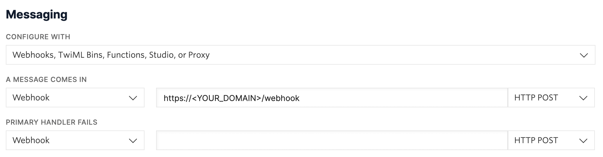

# Challenge #6: Twilio Reminders

## Setup

1. Install `npm` dependencies
2. Create a [Twilio Account](https://www.twilio.com/console), including phone number verification
3. Update the following `[vars]` values within your `wrangler.toml` file:
    * `TEST_RECIPIENT` – this is *your* personal phone number that Twilio asked you to verify
    * `TWILIO_PHONENUMBER` – this is the phone number that Twilio provided you
    * `TWILIO_ACCOUNTSID` – your Account SID, found in the [Twilio Console](https://www.twilio.com/console)
4. Save your Twilio Auth Token, found in the [Twilio Console](https://www.twilio.com/console), as a Worker Secret:
    ```sh
    $ wrangler secret put TWILIO_AUTHTOKEN
    ```
5. Attach your endpoint as an Incoming Message webhook in your [Twilio number's settings](https://www.twilio.com/console/phone-numbers/incoming):
    * Click on your Twilio phone number
    * Scroll down to the **Messaging** section
    * Enter `POST https://DOMAIN/webhook` as your webhook target, where `DOMAIN` is your domain.<br>_**Note:** This Worker script provisions the `POST /webhook` route for you._<br>


## Deploy

A local `"deploy"` script is included, found within the `package.json` file.

This is an alias for `wrangler publish`, but it will also run the `"build"` command before publishing.

```sh
$ npm run deploy
```

## Usage

Once deployed, visit your domain root and enter your _personal_ phone number, which you verified with Twilio. A SMS message will be sent to you with further steps.

> **Note:** The Twilio application will only work with this number for the duration of your Twilio trial.

***Example Demonstration***


